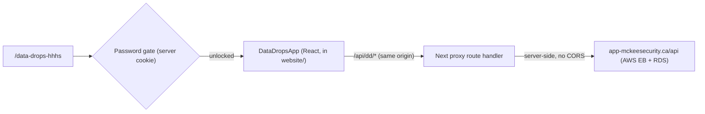

# Data Drops

Data Drops is the internal tool for tracking and confirming network data runs
(cabling drops) at customer sites, with technician and administrator sign-off. It
was previously a minified React app embedded in WordPress via an HTML embed. It is
now rebuilt natively inside the Next.js site, talking to the original (unchanged)
AWS backend.

## Routes (unchanged slugs)

- `/data-drops-hhhs` - Haliburton Highlands Health Services (the hospital; primary use)
- `/data-drops-mckeesecurity` - McKee internal operations

Both are password-gated and excluded from search engines (`noindex`).

## Architecture

- **Frontend:** native React/TypeScript in `website/`, styled with the site's
  Tailwind theme. Multi-tenant by a `tenant` prop, sent to the API as `domain`
  (query) or `site_domain` (body).
- **Gate:** a server component layout checks an httpOnly cookie; an unlock route
  validates the submitted password against `DATA_DROPS_PASSWORD` and sets the cookie.
- **Proxy:** the browser calls our own `/api/dd/*`, which forwards server-side to the
  AWS API. This removes CORS entirely (works in prod, preview, and localhost) and
  keeps the AWS origin off the client.
- **Backend:** Express + MySQL on AWS Elastic Beanstalk (`data-drops-app`) + RDS,
  reached at `https://app-mckeesecurity.ca/api`. See
  [`../data-drops-aws-backend/README.md`](../data-drops-aws-backend/README.md).

## Two passwords (do not confuse them)

1. **Access password** - gates the pages. One shared value across both tenants,
   stored in the Vercel env var `DATA_DROPS_PASSWORD`. Enforced server-side in Next.
2. **Admin deletion password** - required for destructive actions (delete site / day /
   run, revoke signatures). Validated by the AWS backend; the UI only collects it and
   forwards it. It is not stored on Vercel.

## Key files (website)

- `src/app/(data-drops)/layout.tsx` - server password gate + `noindex`
- `src/app/(data-drops)/data-drops-hhhs/page.tsx`, `.../data-drops-mckeesecurity/page.tsx`
- `src/app/api/data-drops/unlock/route.ts` - password check, sets cookie
- `src/app/api/dd/[...path]/route.ts` - same-origin proxy to the AWS API
- `src/components/data-drops/*` - app shell + SiteSelector, SiteOverview, RunDetails, and `ui/` primitives
- `src/lib/data-drops/*` - typed API client, tenant config, date/status helpers, gate logic

## Key findings and lessons learned

- **The live deployment was newer than the local repos.** The true production
  frontend and backend lived on a different machine. The minified bundle served by
  WordPress was the authoritative frontend contract, and the deployed backend differed
  from the checked-out source (for example, listing sites via `GET /api/sites?domain=`
  rather than a POST body). Reconcile local vs remote vs deployed before treating any
  checkout as the source of truth.
- **Same-origin proxy beats CORS edits.** Routing API calls through a Next route
  handler avoided any backend CORS changes and works identically in prod, preview, and
  local. It also avoided the risk of redeploying a divergent backend.
- **Next 16 specifics.** `middleware` is renamed to `proxy`, `cookies()` is async, and
  route handler `params` is a Promise. We used a server-component layout for the gate,
  so no `proxy.ts` was needed for auth.
- **The EB config pointed at the wrong server.** `.elasticbeanstalk/config.yml` had
  been copied from the unrelated `nvr-backup` project (app "Express App", env
  `nvr-backup`). The real target is application/environment `data-drops-app`. Always
  verify with `eb status` / `aws elasticbeanstalk describe-environments` before deploy.
- **The backend committed `node_modules`** (empty `.gitignore`). It was excluded on
  import; the monorepo root `.gitignore` covers it going forward.
- **`.ebignore` makes monorepo deploys safe.** With it, `eb deploy` bundles only the
  backend folder's working tree (ignoring git), which both scopes the upload and lets
  us deploy a fix before committing.
- **The per-tenant bug.** `getAllSites` read the tenant from the request body, but the
  GET sends it as `?domain=`, so every tenant saw all sites. Fixed to read the query
  first. The frontend already sent `?domain=` correctly, so the backend fix was enough.
