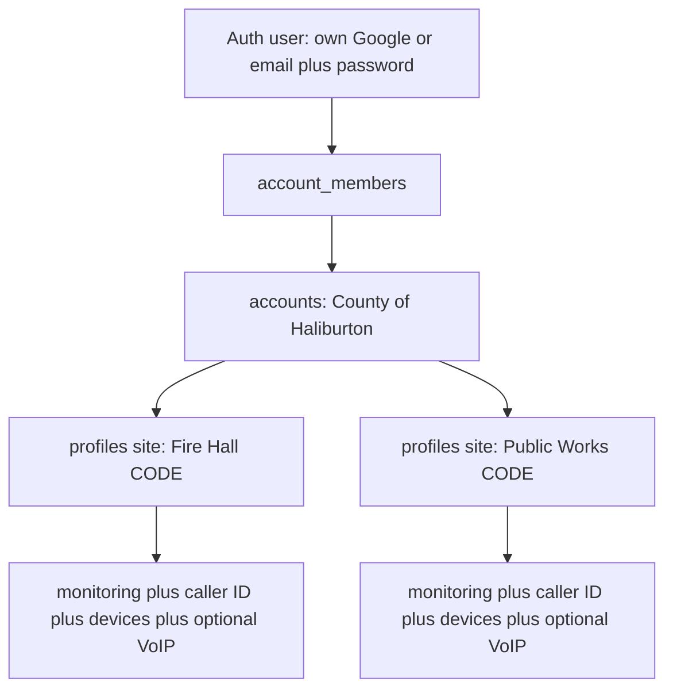

# Multi-site accounts and extra logins

Status: **planned, not built. R54 is done.** Implement this file next, starting at slices 1 and 2 (schema + `resolvePortalSession`). Station layer: [`LANVAC_STATION.md`](LANVAC_STATION.md). Zones, Historic, and **account** on-test stay per site (`profile_id`). One CODE = one site. We never put a single zone on test. Client on-test is Account admin only. Delete cascades `lanvac_*` and does not wipe Lanvac. Do not import real clients until this ships and grouping is signed off. Client mail stays off until Billing-tab `GO LIVE`. **R53 is in `PORTAL_PLAN.md` as planned** (not shipped). Keep this file, R53, 9.5.4 / 9.5.5 / 9.5.5C, and [`PORTAL_CUA_TEST.md`](PORTAL_CUA_TEST.md) in the same commit as each implementation slice. Do not start the Windows QuickBooks bridge or CUA until those slices ship.

## How it works today (why the county cannot log in once)

A portal **client is one `profiles` row**. That row is also the login, the billing contact, and the site:

- One `user_id` (unique): one Google / password per client
- One `email` (unique when set): a second property cannot reuse the county email
- One `lanvac_account_code` (unique when set): one station CODE. After R54, that CODE also owns one zone list, Historic pull, and on-test state (`profile_id` only).
- [`unique (profile_id, service_type)`](website/src/lib/portal/database.types.ts): at most one monitoring and one VoIP on that row

Caller ID, devices, and Stripe live on that same row. [`getAuthContext`](website/src/lib/portal/auth.ts) loads **one** profile by `user_id`. RLS everywhere is `p.user_id = auth.uid()`.

So “assign their account to another system” is not supported. Creating a second client with the same email fails. Two emails means two logins and two inboxes.

Track 2 already planned a camera `sites` table. We will **not** reuse that for billing and we will **not** name the new org table `sites`. Moving services, caller ID, and devices onto a new `site_id` would rewrite the whole portal before import. The camera table stays Phase 6A.

## Recommended model

Treat today’s profile as a **site**. Add an **account** (household or organization) and **members** (people who can sign in).

- **Account:** name, `auto_onboard`. One place to invite staff. A person may belong to more than one account (house + business). The switcher then lists sites grouped by account.
- **Site (`profiles`):** address, Lanvac CODE/city, caller list, **R54 zone list / Historic / on-test**, devices, services, per-site Stripe customer and due dates. One CODE = one site. VoIP belongs to that site. Station tables stay on `profile_id`. No county mega-form of all zones.
- **Person on the account:** their own email and their own sign-in. They see **every site on that account** (per-site ACL can wait). Extra people do **not** get `profiles.user_id`. Access is membership, not “this user owns this row.”
- **McKee staff** (`profiles.role = admin`) can always attach sites, invite, and revoke. They do **not** get a client account row.

**Client-facing roles (locked):** **Account admin** and **Member**. Schema: `owner` and `member`. Do not say Master or Manager (both sound like bosses). Do not say Admin alone (that is McKee staff on the staff console). “User” is anyone signed in, including the account admin, so the lower role is Member.

A house with one alarm: one account, one site, one account admin. The extra UI stays hidden. Most clients stay on this screen for good. Org chrome (sites list, People with access, role words) appears only when there is a second site or a second person.

The county: one account, many sites, one or more members. They never share a Gmail. They can still choose a shared generic inbox if they want; that is an ops choice, not a requirement.

## Hardening audit (must follow during implementation)

These are live paths that would break if we only added tables and a switcher.

**1. Extra members look like orphans today.** Sign-in ([`sign-in.tsx`](website/src/components/portal/sign-in.tsx)), Google callback ([`api/auth/callback/route.ts`](website/src/app/api/auth/callback/route.ts)), layout, and [`getAuthContext`](website/src/lib/portal/auth.ts) all require `profiles.user_id`. The cleanup cron ([`cleanup.ts`](website/src/lib/portal/cron/cleanup.ts)) deletes auth users older than 7 days with no `profiles.user_id`. A county staff login that only exists on `account_members` would be signed out and then deleted. Every one of those paths must treat `account_members.user_id` as a linked account.

**2. First-access password gate is per login, not per membership.** [`password_set_at`](website/src/app/(portal)/user-dashboard/layout.tsx) is on `profiles` and stamped by `user_id`. Extra members need it on `account_members`. A person on house + county must not be forced through password setup again. Gate: this auth user has `password_set_at` on **any** of their member rows. Setting a password stamps **all** of their member rows. New memberships for that `user_id` copy it (insert trigger).

**3. Delete site must not delete the county login.** [`deleteClientAction`](website/src/lib/portal/actions/clients.ts) deletes `auth.users` whenever `profile.user_id` is set, **before** the profile row. Deleting one school would lock every other county site, and a later profile-delete failure would leave a dead login. Rules:

- Delete is **this site only** (services, caller ID, devices, `lanvac_*` station rows, that profile). Do not call Lanvac delete-all.
- Cancel Stripe subscriptions on **that** site only.
- Delete the profile (and empty account if last site) **first**. Only then delete Auth, and only if that user has no remaining membership and no remaining `profiles.user_id`.
- Confirm copy must say “this site” when the account has more than one site.

**4. Disable is per-site, including the home site.** `setClientStatusAction` stays on one profile. [`user-dashboard/layout.tsx`](website/src/app/(portal)/user-dashboard/layout.tsx) and `requireUser()` today lock the whole login when the **home** row is `disabled`. After this change, disable of one site must not lock other active sites. Layout / `requireUser` succeed if the person has **any** active accessible site; the switcher skips disabled rows. If **every** accessible site is disabled, show a clear “this account is disabled” screen, not the orphan-no-profile screen. Admin disable UI in [`admin-client-detail.tsx`](website/src/components/admin-portal/admin-client-detail.tsx) is hidden unless `client.user_id || disabled` — county sites with `user_id` null cannot be disabled today. Show disable for every client site. Do not disable the Auth user unless McKee is disabling (or deleting) the last site they can access.

**5. Last owner.** Cannot revoke the last owner. Cannot attach the last site away from an account that still has members and no remaining owner. Moving a site that empties the source account deletes that empty account. Do **not** flip `auto_onboard` back on when a multi-site account shrinks to one site.

**6. Stripe email reuse would merge county bills.** [`findOrCreateStripeCustomer`](website/src/lib/portal/stripe.ts) already prefers `metadata.profile_id`, then falls through to “any customer with a card” and then `listed.data[0]`. After we allow duplicate `profiles.email`, two county sites would steal one Stripe customer and overwrite `metadata.profile_id`. Reuse only when `metadata.profile_id` matches this site, or when this site already has `stripe_customer_id`. Never pick “first / has-card customer with this email.”

**7. Settings vs sign-in email.** Site contact email may repeat and is **not** the login. Settings keeps the **member** email locked (sign-in identity). Phone and address writes apply to the **selected site only**. If the site contact email differs from the member email, show it as a separate admin-maintained line, not as the login.

**8. Invitations.** Keep the existing one-open-invite-per-**site** row for first activation. Extra people use invite hash/expiry on `account_members`, not a second `invitations.profile_id` (that unique index would block resend on the home site). Member invite mail is client-facing: honor R52 (`dispatchClientEmail`) and `auto_onboard`. Staff can always copy the link.

**9. Add a site to an already-active account.** Do not insert an `invitations` row and do not email. New site: `user_id` null, `status = active` if the account already has an activated owner (they can use it immediately), otherwise `pending` with no mail until McKee invites the owner once. [`admin_create_client`](supabase/migrations/20260813163800_voip_hardening.sql) gets `p_account_id uuid default null` so older callers keep resolving.

**10. Attach after import.** When McKee groups pending imported sites onto one account, **expire unused site invitations** on the attached rows so a later GO LIVE cannot send 40 activate-and-add-a-card emails. Invite the owner once.

**11. Server actions must take a site id.** Caller ID, devices, billing, settings, and **R54 station actions** (zone pull, **account** on-test) already take `profileId` from day one. After this change they must `can_access_profile` it. Never write the first site in `sites[]` by accident. Client on-test stays **Account admin only** and is always the whole CODE, never a single zone. Members see the chip. On-test is per site (one CODE).

**12. Site cookie / `?site=`.** Only honor a site the member can access and that is not disabled. Otherwise first active site. A crafted id is not an IDOR.

**13. RLS helper.** `private.can_access_profile(profile_id)` is security definer, `search_path = ''`, same grant pattern as `is_admin()`. Membership only (see schema). It must not recurse through profiles RLS. `is_admin()` stays “this auth user has a profile with `role = admin`.” INSERT…RETURNING on caller ID still needs the SELECT policy to see the new row. [`save_caller_id_list`](supabase/migrations/20260813201834_caller_id_sort_order.sql) has no in-function auth today (RLS on child tables only). Add `can_access_profile(p_profile_id)` inside the RPC.

**14. Insert trigger for scripts.** Check scripts insert into `profiles` without `account_id`. A `role = client` insert with null `account_id` must create a one-site account (trigger or RPC), or every gate script breaks. Document the trigger so seed-admin / rls-pentest keep working.

**15. Client mail and reminders.** Site-facing mail (invite, reminder, receipt, caller-ID notice, device notice) uses the **site contact email** when set, else the owner member email. Never send the same reminder to every member. Admin alerts can name the account plus the site.

**16. One person, two accounts.** Unique member email is per account, not global. `getAuthContext` unions all sites for all memberships. Switcher groups by account name.

**17. `requireUser` today returns the home site.** [`getAuthContext`](website/src/lib/portal/auth.ts) is `.eq("user_id", claims.sub).maybeSingle()`. [`updateMyAccountAction`](website/src/lib/portal/actions/account.ts) then writes `.eq("id", profile.id).eq("user_id", user.id)`. Extra members have no `profiles.user_id`, so they cannot save phone/address at all. Owners would keep writing the **home** site even when the switcher shows another site. Context must return `sites[]` plus `selectedSite` (cookie / `?site=`). Writes take `profileId` and `can_access_profile`. Drop the `user_id` write guard.

**18. Re-enable after disable.** [`setClientStatusAction`](website/src/lib/portal/actions/clients.ts) refuses `status = active` when `user_id` is null (“has not activated yet”). A second county site is active with `user_id` null by design. After McKee disables it, re-enable must be allowed when the account already has an activated owner.

**19. Member invite to an email that already has a login.** [`activateWithPassword`](website/src/lib/portal/actions/activation.ts) calls `createUser` and on `email_exists` tells them to sign in first. Compensation deletes the auth user if linking fails. Extra-member activation must **never** `createUser` when that email already exists, must **never** `deleteUser` as compensation for an existing user, and must link `account_members.user_id` only (not steal `profiles.user_id` on a site). Reuse the existing “activate as current user” path.

**20. Live attach is allowed (backstop), prevent-first is the real fix.** Create-client and import must attach to the known county account up front so a stray login is never created. McKee can still attach a live site later (wrong invite, someone activated one CODE). Rules:

- Keep `profiles.user_id` so that person can still sign in.
- Move the site onto the target account. Migrate source people onto the target as **members** (do not mint a second account admin). If their email is already on the account, keep the existing row and role.
- Add the live site’s `user_id` holder as a target **member** if they are not already on the account.
- Empty source account is deleted. Do not flip `auto_onboard` back on.
- Expire unused invitations on attached pending sites.
- **Access is membership only.** `user_id` is a leftover home-site pointer (`is_admin()`, first-owner backfill), not a second ACL. `can_access_profile` must not treat leftover `user_id` as access, or revoke cannot remove the original owner of an attached school.
- Revoke (and last-site delete) clears `profiles.user_id` when it matches that user, then deletes Auth only if they have no remaining memberships.
- **Who can attach (confirmed):** McKee can attach any pending or live site to any account (typed confirm). An account admin can move a site only from an account they administer onto another account they already belong to. Members cannot attach. A county account admin cannot search up a stranger’s CODE and take it. Consent for a client-driven merge is existing membership: invite the stray person to the county, then they attach their site, or McKee attaches. No separate merge-request email this pass.

**21. One account admin per account.** Schema `owner` is shown as **Account admin**. They are the only client who can invite or revoke people, change roles, attach a site they already belong to, and **Transfer account admin** to another **member** who already has auth on this account (that person becomes Account admin, the former one becomes a Member). Members use the sites. They cannot add logins, remove people, or transfer. McKee staff can transfer too. Cannot revoke the last/only account admin; transfer first. Do not add a third role. Settings → People with access uses this language. Members see the list grayed out.

**22. First-owner activation still uses `linkProfileToUser`.** That UPDATE requires `user_id is null` and `status = pending`. Adding a site to an active account skips that path (`user_id` stays null, `status = active`). Extra-member invites never call `linkProfileToUser`. [`activateAsCurrentUser`](website/src/lib/portal/actions/activation.ts) today errors if a profile already exists. An owner with a leftover home `user_id` must not be blocked from accepting a **member** invite. Site-invite tokens on already-attached active sites stay invalid (`validateInvitationToken`).

**23. One session helper, every client write.** Replace “call `requireUser()` and use `profile.id`” with `resolvePortalSession()` (user, memberships, sites, selected site, whether they are account admin on the selected account) and `requireSelectedSite(profileId)` that 404s unless `can_access_profile` and the site is not disabled. Cookie / `?site=` are validated here only (httpOnly, Secure in production, `SameSite=Lax`, path scoped to the client portal). New actions cannot forget a site id. Invite / revoke / transfer are rate-limited like activation.

**24. Admin list and digest noise.** Clients list must chip “County of Haliburton, 14 sites” and search by account name. Collections digest should group by account so 14 county lines are not 14 unrelated people. “Activated” means the **account** has an activated owner, not “this row has `user_id`.”

**25. Keep the `accounts` table name.** Client-facing words: **account**, **site**, **Account admin**, **Member**, People with access. Never “Admin” alone (McKee staff). Do not say Master, Manager, owner, or an organization checkbox. Do not name a table `sites` (Phase 6A cameras). Do not rename `profiles`. Stripe/QB “customer” stays per site.

## What clients see

- **One site and one member:** today’s dashboard. No switcher, no sites list, no “people with access.”
- **Two or more sites:** a **sites list** (name, address, CODE, short caller-list summary) so they can see every system without opening 14 logins, plus a switcher. Clicking a row selects that site. Billing, the full caller-ID editor, VoIP, and devices stay **one site at a time** (one CODE, one Stripe customer, one VoIP). Do not build one combined editable call-list for every site on one form (easy to save the wrong list).
- **A second person (even on one site):** Settings → People with access. Copy: the Account admin can invite people, revoke them, and Transfer account admin to someone already on the list. Members see the same list grayed out, with a line that only the Account admin can change who has access.
- Switching is `?site=<profileId>` plus a cookie set by the server. Attach/merge controls appear only for an Account admin who belongs to **two or more** accounts.
- Extra people get a Member invitation and set their own Google or password. Revoke drops membership; it does not delete the site.

## What McKee sees (two admin flows)

The Clients tab has **two buttons**, not one form that tries to do both. They share the site-fields UI (address, phone, CODE, city, monitoring, VoIP, billing rail) so the form is not duplicated.

**1. New client** (today’s button). Always **one new account + one site**. No “is this an organization?” checkbox. An account is just an account; the extra UI appears when a second site or second person exists. First/last/email become the Account admin and the site contact. Invitation is created (held until GO LIVE / `auto_onboard`). If they later need a second CODE, staff leave this flow and use Add site. Do **not** put “add another site” on this form.

If the typed email already belongs to a member or a site contact, warn and offer to switch to **Add site to an account** (the 9.5.4 near-duplicate warning, but it actually attaches).

**2. Add site to an account.** Pick the account first (search name, email, or CODE). Then only the site: display name (still `first_name` / `last_name`, e.g. Stanhope / Public Works), address, optional site-contact email (not a new login), CODE, city, services, billing rail. No automatic invitation. `auto_onboard` turns off when this is the second site; the extra client UI appears. If that account already has an activated account admin, they stay the account admin. If it does not (imported pending sites), use **Appoint account admin** (below). Same action from the client-detail **Account** card when staff are already looking at the county.

Account card on client detail also has: account name and site count, links to sibling sites, members (invite/revoke), attach/move a **pending or live** site (rules in item 20), **Auto-onboard** toggle.

Clients list: chip “County of Haliburton, 14 sites” and search by account name.

**Billing is already per site.** Each site has its own `services` row, `next_due_on`, Stripe customer (or manual rail), and optional VoIP. Adding a monitoring account to Halliburton County does not share the Fire Hall due date or card. The Billing tab and payment-due cron already list one line per service; after this change they should also show the account name so 14 county renewals are not 14 strangers. Staff set that new site’s due date on its Billing card the same way they do today (create currently stamps `next_due_on` to today on the manual rail; they correct it on the site).

## Import grouping (Lanvac Excel + QB) — human, not automatic

Read of the gitignored export [`10638 Customer User List Report.xls`](10638%20Customer%20User%20List%20Report.xls) (sheet LANVAC, 13,922 rows, **703 unique CODEs**). Columns are CODE, NAME, ADDRESS, POSTAL CODE, CITY, PHONE, then the call-list slots. There is **no organization id, no parent CODE, and no email**. One CODE is one site. That is all the file can state for sure.

**We cannot infer org membership well enough to auto-attach.**

- Exact same NAME on 2+ CODEs: only **23 names / 50 codes**. Most are a person or small business with two properties, plus junk (`NEW CUSTOMER` × 3). Useful as a review flag. Wrong as an auto-merge (do not invent an org named NEW CUSTOMER).
- Civic keywords look organizational and are still the wrong merge key. `COUNTY OF HALIBURTON` is **one** CODE. Other county-ish rows use building names (`STANHOPE PUBLIC WORKS GARAGE`, `DYSART LIBRARY`, `MINDEN MUNICIPAL OFFICE`, `HALIBURTON COUNTY REGISTRY OFFICE`). Auto-grouping every NAME that contains COUNTY / MUNICIPAL / LIBRARY would glue **separate municipalities** together (Dysart et al, Highlands East, Faraday, historic Anson/Minden, Stanhope/Algonquin Highlands, plus the County). That is the failure mode this pass exists to prevent.
- Shared 10-digit PHONE: 8 numbers across 16 codes. Shared normalized ADDRESS: 15 across 30 codes. Too weak; often two systems at one building or a reused shop number.
- First-two-word clusters (`STEVE AND…`, `HALIBURTON HIGHLANDS…`) are people or unrelated businesses. Ignore.

Seed still creates **one pending site per CODE / QB customer**. Suggestions are a helper, not a commit:

1. The importer (and a post-seed review board) **guesses** likely groups: exact NAME on 2+ CODEs; civic/municipal keywords; same QB email; QB `parent_list_id` / job. Show raw NAME + CODE + city so staff can see County vs Dysart vs Faraday. Accept / reject / edit (split Faraday out, merge two suggestions, name the account). Accept is what creates the org and attaches those sites.
2. **Human pass is a hard import gate.** A person must walk the suggestion list, confirm nothing obvious is missing, and sign off (`portal_settings.org_grouping_reviewed_at` or equivalent). GO LIVE refuses until that timestamp is set. “Looks fine, ship it” without the pass is the failure mode.
3. Attach on accept expires leftover per-site invites and turns `auto_onboard` off.
4. Do **not** email anyone from this step.

~703 Lanvac CODEs vs ~650 clean QB monitoring rows will not line up 1:1. Extra codes stay unmatched for a human.

Those import rules are already written into [PORTAL_PLAN.md](../PORTAL_PLAN.md) 9.5.4 / 9.5.5 / 9.5.5C / R53, [ACCOUNTING_PLAN.md](../ACCOUNTING_PLAN.md), and the [PRODUCT_HANDOVER.md](../PRODUCT_HANDOVER.md) header. Keep them in lockstep when a slice changes behavior.

`accounts.auto_onboard` (default **true** for a new single site):

- Turns **off** automatically when a second site is attached.
- McKee can turn it off earlier (county, messy accounts).
- While off: no **automatic** onboarding mail (create-client invite, resend, member-invite, future R40 “billing is due, activate and add a card”). Staff can still copy a link. **Appoint account admin / Send account-admin setup** is a human click and is allowed while `auto_onboard` is off (that is how the county is set up before a bill is due). It is still behind GO LIVE.
- Do **not** treat this as “no mail at all.” After GO LIVE, payment reminders, receipts, caller-ID notices, and device notices still send to the **site contact** (else owner). Those are live-account operations, not onboarding.
- The global **Client email / GO LIVE** gate ([9.5.5C](PORTAL_PLAN.md)) stays in front of everything. That already covers testing. This flag is the extra brake for multi-site even after go-live.

R40 invite-when-due is **not built yet**. When it is built, a multi-site account with **no activated account admin** must not send the single-house “activate and add a card” letter, and must not send one invite per site. It sends **one** account-level **organization / Account admin setup** email (template below). Prefer Appoint account admin before any bill is due so that letter is not the first time they hear about the portal.

## Appoint account admin (human outreach, then one email)

This is how the county (and any other grouped account) gets a real person before their first site is due. It is not an org checkbox on New client, and it is not the per-site activation invite.

**When an account admin already exists.** Adding a second site to a live house or shop does not ask “make this an organization?” The same account grows a second site, `auto_onboard` turns off, the extra UI appears, and the person who already activated stays the Account admin.

**When no account admin exists yet** (import: many pending sites, no login). After the grouping pass, McKee calls the org: “Who should be the account admin for all of these call lists?” That name/email is stored as a pending **owner** row (not a site invitation). Billing tab / Account card shows an **Appoint account admin** queue: multi-site accounts with no activated owner.

**The Account admin setup email** (same template for Appoint account admin and for a later bill/invite if McKee never named anyone):

Use this template whenever the account has **two or more sites** (or is already treated as grouped) **and no one has auth yet**. Do not use the single-site activation letter.

- One special link. They become the **Account admin** for the whole account (every site), not for one CODE.
- Short brief: the Account admin is the only person who can add or remove logins and who can Transfer account admin to a Member already on the account. Members can open every site, edit that site’s call list and billing, and cannot change who has access.
- What the portal is: sites, call lists, a bill per site.
- If this send is tied to a due date, say which site is due and that the other sites stay on their own dates.
- Ask them to add billing staff as Members if someone else pays.

Human **Send** after GO LIVE is allowed while `auto_onboard` is off. Copy-link works while mail is paused. One open Account admin invite per account; resend rotates it. A site-level Resend on a grouped account with no account admin must send this template (or refuse and point at Appoint account admin), never 14 house invites.

If an Account admin already exists, a bill is only a payment reminder. No “create your account.”

**GO LIVE checklist** (9.5.5C, when we edit docs): import complete, sample spot-checked, **organization grouping signed off**, QB bridge on the live file, ready for customer email. Appointing every account admin is the next human wave after the flip (or the first sends after the flip), not a second typed phrase. The queue makes “county not invited yet” visible.

QuickBooks stays **one QB customer per site** (`qb_customers.profile_id` unique). Do not merge county jobs into one QB customer.

## Schema and access (first build)

New migration (CLI `supabase migration new`, then hosted `apply_migration`):

- `accounts`: `id`, `name`, `auto_onboard boolean default true`, timestamps
- `portal_settings.org_grouping_reviewed_at` (nullable). [`setClientMailEnabledAction`](website/src/lib/portal/actions/settings.ts) must refuse GO LIVE until it is set. Sign-off is allowed when the suggestion queue is **empty** (nothing to group yet, or everything accepted/rejected). That way this gate does not block a future flip before the first import.
- `account_members`: `account_id`, `user_id` (null until they activate), `email`, `role` (`owner` | `member`), `password_set_at`, invite hash/expiry, unique `(account_id, lower(email))`, unique `(user_id, account_id)` when `user_id` is set, **unique `(account_id)` where `role = 'owner'`** (one Account admin, enforced)
- RLS: clients SELECT accounts they belong to; only McKee staff UPDATE `accounts` / `auto_onboard`. Member invite / revoke / transfer are service-role actions that re-check the caller is the account admin (or staff). Members cannot invite via a crafted request.
- `profiles.account_id` nullable; CHECK: `role = client` implies `account_id is not null`. Admins have no client account.
- Backfill: every existing **client** profile gets its own account (`name` = first + last). If `user_id` is set, insert an owner member and copy `password_set_at`.
- Client insert trigger: if `account_id` is null, create a one-site account (keeps check scripts and seed working).
- `private.can_access_profile(profile_id)` is **membership only** (this auth user has an `account_members` row on `profiles.account_id`). Do **not** also grant access via leftover `profiles.user_id` (that would make revoke fail). Staff stay on `is_admin()`.
- Indexes: `account_members(user_id)`, `account_members(account_id)`, `profiles(account_id)`.
- Replace client RLS that uses `p.user_id = auth.uid()` (services, caller ID, devices, payments, billing events, cloud interest, `profiles` select) with `can_access_profile`. `save_caller_id_list` must also `can_access_profile(p_profile_id)` inside the RPC, not only via child-table RLS.
- `cloud_backup_interest` must drop the `lower(p.email) = inserted.email` match against the site contact (member login may differ).
- Drop **global** unique `profiles.email`. Site contact email may repeat (county). Login identity is the member email / Auth user. Keep unique Lanvac CODE.

Activation ([`linkProfileToUser`](website/src/lib/portal/actions/activation.ts)): also upsert the owner member on that site’s account. Extra-member activation links `account_members.user_id` only.

## Docs and gates

**R53 is already in [PORTAL_PLAN.md](../PORTAL_PLAN.md)** as planned (account vs site, Account admin vs Member, hidden single-site UI, no org checkbox, grouping sign-off, Appoint account admin, `auto_onboard`, delete/disable, Stripe email rule, per-site due dates). 9.5.4 / 9.5.5 / 9.5.5C and [ACCOUNTING_PLAN.md](../ACCOUNTING_PLAN.md) match. [PRODUCT_HANDOVER.md](../PRODUCT_HANDOVER.md) header points at the two Clients-tab buttons + Appoint account admin. When a slice ships, mark the matching R53 bullets as built and update the CUA playbook in the same commit.

Update [`rls-pentest.mjs`](website/scripts/rls-pentest.mjs), [`rls-check.mjs`](website/scripts/rls-check.mjs), [`activation-check.mjs`](website/scripts/activation-check.mjs), and cleanup expectations in [`cron-check.mjs`](website/scripts/cron-check.mjs): client A cannot see client B’s site; a second site on A’s account is visible; a member without `profiles.user_id` is not an orphan; client cannot flip `auto_onboard` unless we add a client UPDATE (we will not: only admin RLS UPDATE on accounts).

## Out of scope for this pass

- Per-site permission (this person only sees one school)
- One combined county invoice / one shared Stripe customer
- Merging QuickBooks customers
- Camera `sites` table
- Building the R40 invite-when-due queue (only the flag it will read)
- A third database role (client-facing **Account admin** is `owner`; **Member** is `member`)
- Client merge-request email (“let us take your site”)
- Auto-attaching Lanvac/QB rows into organizations (suggestions + human accept only)
- A multi-site wizard or “is this an organization?” checkbox on New client
- Sending the account-admin setup email before GO LIVE (copy-link only)

## Second audit (original goal vs this architecture)

Original ask: one login for many systems, extra staff logins without sharing Gmail, create-client warning when that email already has a system, switch or browse by location, hide the extra UI for single-system clients, per-site subscriptions and VoIP, import grouped by hand so the county is invited once, auto-onboard off for multi-site, GO LIVE before any client mail, and a client owner who can grant/revoke access and add more account numbers.

**The model still fits.** This codebase is one profile = one CODE = one Stripe customer = one QB customer = one caller list. Adding `accounts` + `account_members` and treating `profiles` as the site is the smallest change that preserves that graph. Alternatives that fail here:

- One profile with many addresses in JSON: breaks unique Lanvac CODE, QB 1:1, Stripe per site, VoIP-per-site.
- Put the same `user_id` on every county row: blocked by unique `profiles.user_id`, and revoke cannot work.
- Rename `profiles` to `sites`: collides with Phase 6A camera `sites` and rewrites every `profile_id` FK.
- Linked profiles with no account table: no shared name, no `auto_onboard`, no Account admin / Member, no People list.

**What this pass must still add (was easy to miss):**

- A **sites list** (not only a switcher) so the county can see every call list at a glance, then edit one. That is the “central management” ask without a dangerous mega-form.
- `auto_onboard` is onboarding-only, not a mute on payment/caller-ID/device mail.
- Password gate is per Auth user (house + county).
- Disable of the home site must not lock the login.
- Admin can disable a site that has no `user_id`.
- `save_caller_id_list` and `cloud_backup_interest` policies, not only the obvious `user_id = auth.uid()` selects.
- One `resolvePortalSession` / `requireSelectedSite` helper so a later action cannot write the home site by accident.

## Third audit (remaining holes, then ship)

**Grouping review is not blocked on the unbuilt 8A importer.** The suggestion board runs on **existing** `profiles` (same NAME, civic keywords, same contact email, QB `parent_list_id` when present). Accept attaches; reject dismisses. After 8A seed, the same board reviews the new rows. A one-off Excel pass can prefill the same queue later. Do not wait for a separate AI service.

**Transfer account admin** is one transaction: target must already be an activated member on that account; confirm in the UI; unique `owner` index makes a double-submit fail clean. Former admin becomes `member`.

**Account-admin setup email** goes through `dispatchClientEmail` and [`email-render-check.mjs`](website/scripts/email-render-check.mjs) (same mail-client checks as Starlink: no rgba text, no orphan blocks, wrap long CODEs).

**Implementation order** (do not land as one unreviewable dump):

1. Schema, backfill, RLS, unique owner, insert trigger, check-script trigger
2. `resolvePortalSession` + orphan / OAuth / cleanup / password
3. Delete, disable, Stripe email reuse
4. Admin: two buttons, Account card, grouping board + empty-queue sign-off, Appoint account admin
5. Client: sites list / switcher / People (hidden for the majority)
6. Emails + render check
7. Keep PORTAL_PLAN R53 / 9.5.4 / 9.5.5 / 9.5.5C and this file current as each slice lands (R53 is already written as planned)
8. **Living CUA playbook.** Update [`docs/PORTAL_CUA_TEST.md`](PORTAL_CUA_TEST.md) in the same slice as the UI it describes. After deploy, a computer-using agent runs that file (devtools on) and writes a findings report. **This is the last gate before the Windows MCP bridge and the real import.** Do not start either until the report is clean or every fail is accepted.
9. Do **not** flip GO LIVE, start the Windows bridge, or send Lanvac `fullupdate`

**Pacing (locked):** R54 is complete (read UI, O5985-gated zone writes, **account-only** on-test). This file matches: zones / Historic / account on-test stay per-site (`profile_id`). **Next implementation is slices 1 and 2** (schema + `resolvePortalSession` / orphan / OAuth / cleanup / password), then stop for an end-to-end audit. Do not start slice 3 until that audit is done. Same pattern for 3–4, 5–6, then CUA. Hosted has **staff and throwaway test clients only**.

**Alignment:** 10/10 to implement R53. Station tables stay on `profile_id`; actions already take `profileId`; on-test is the whole CODE for that site, never a zone; client start/stop is Account admin only. Execution risk on later R53 slices stays; that is why we pause and audit instead of one-shotting.

## Already shipped (do not redo)

Client-facing mail is off until Billing-tab `GO LIVE` (`f9d44af` on `main`). That is the production brake for all automated onboarding mail. Multi-site `auto_onboard` is the second brake after go-live. `due_alerted_at` and `expiry_alerted_at` are not stamped while a client send is held, so the first run after the flip still notifies the customer.
